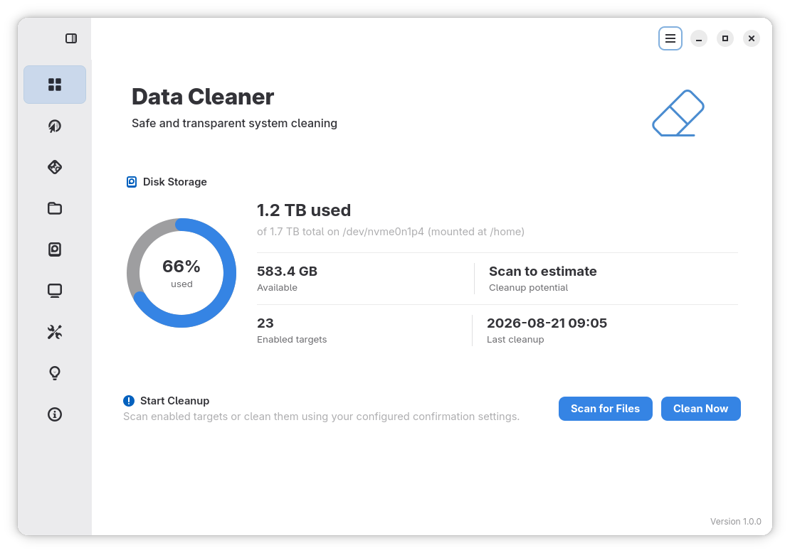

# Data Cleaner

Data Cleaner is a native Linux application for safely reclaiming disk space. Built with Rust, GTK 4, and libadwaita, it provides a clean GNOME-style interface for reviewing and removing browser data, application caches, temporary files, logs, and other unnecessary data.



## Features

- Clean supported browser caches and data, with unavailable browsers clearly disabled.
- Remove application caches, temporary files, thumbnails, trash, and custom directories.
- Analyze storage visually and find large files or folders.
- Clean application logs using a configurable retention period.
- Schedule automatic cleanup on selected days and times.
- Start Data Cleaner automatically at login for scheduled tasks.
- Review detailed results after every cleanup, including deleted, skipped, and failed items.
- Integrate with the system tray and follow the current GNOME color scheme and accent color.

## Safety

Data Cleaner is designed to make cleanup operations transparent and predictable:

- Manual cleanup can require confirmation before deletion.
- Critical system paths are protected by a built-in denylist.
- Operation limits can prevent unexpectedly large cleanups.
- Active browsers are detected to reduce the risk of database corruption.
- System journal cleanup requires administrator approval.
- Cleanup logs are kept in memory and are not written permanently without user consent.

Always review the selected cleanup options before removing data you may want to keep, especially browser cookies and session data.

## Requirements

- Linux
- Rust stable and Cargo
- GTK 4.8 or newer
- libadwaita 1.2 or newer
- GLib development tools and `pkg-config`

The exact development package names depend on your Linux distribution.

## Build from Source

```bash
git clone https://github.com/christosdaggas/Cleaner.git
cd Cleaner
cargo build --release --locked
```

Run the optimized build:

```bash
./target/release/data-cleaner
```

For development:

```bash
cargo run --locked
```

## Packaging

The repository includes helper scripts for creating common Linux packages:

```bash
./scripts/package-rpm.sh
./scripts/package-deb.sh
./scripts/package-appimage.sh
```

Generated packages are placed under the `dist/` directory. The installed package and command name is `data-cleaner`.

## Contributing

Contributions, bug reports, and feature suggestions are welcome.

1. Fork the repository.
2. Create a branch for your change.
3. Run the checks before submitting:

   ```bash
   cargo test --locked
   cargo clippy --all-targets --locked -- -D warnings
   ```

4. Open a pull request with a clear description of the change.

Please use [GitHub Issues](https://github.com/christosdaggas/Cleaner/issues) to report bugs or suggest improvements.

## License

Data Cleaner is released under the [MIT License](LICENSE).
